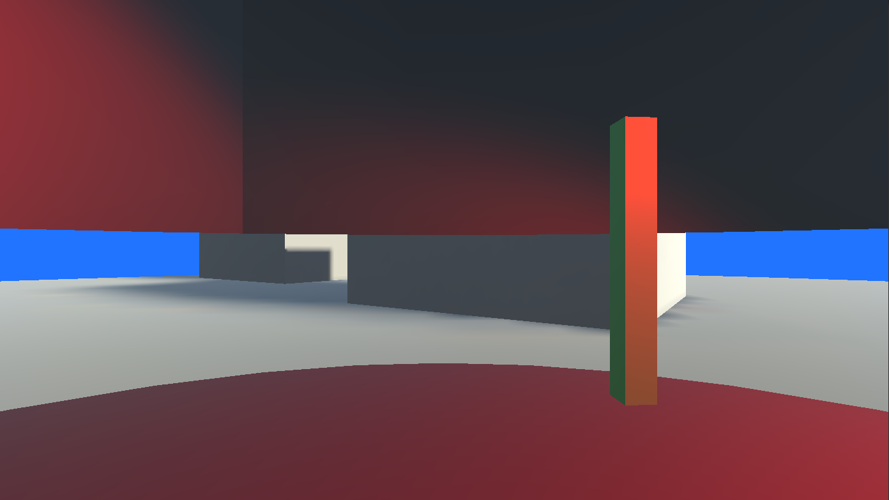

# Stencil Buffer Panorama

* green pillar is an occluder - it occludes the stenciled panorama projection
* the room is illuminated by a red light, as are occluders
* content of the panorama projection resides in separate scene for easier editing later on
* content of panorama is comprised of two cubes, a ground plane and a skybox (sphere, blue)
* light on panomara content is baked

# Shaders

Shaders reside in the Menu: "Stencil/Panorama/*". Shaders are rendering in Transparent queue to enable writing to stencil buffer in deferred rendering: https://docs.unity3d.com/Manual/SL-Stencil.html

# Rendering order and logic

Transparent Queue (3000)

| Queue | Menu location | Stencil Operation | Notes |
| --- | --- | --- | --- |
|+50| Stencil/Panorama/Surface | always writes 2 | ignores z-test fails (always writes 2 everywhere the mesh is on screen)|
|+51| Stencil/Panorama/Occlusion | always writes 1| |
|+52| Stencil/Panorama/Skybox | where 2 is written | writes to z-buffer, does not test for z|
|+53| Stencil/Panorama/Content | where 2 is written | writes to z-buffer|

# Scenes

* default scene contains basic setup
* panorama scene is used for prebaked lighting and environment editing

# Setup

* Room light (red) is only rendered to layers "Default" (room) and "Occluders" (green pillar). 
* Sun is set to Baked mode, only rendered to "Environment" layer

